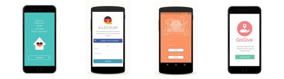

class:center, middle
# Techfugees Berlin
Introduction
27-10-2015

---
class:center, middle
# Who are we

 Tadas Ziemys and Edgar Neto

 Developers @ Memorado

 2 of the 4 authors of [Refugermany](https://github.com/Memorado/refugermany)

---
class:center, middle
#Why are we here?
 Our company promoted a hack event

 1 week = 4 apps, published

 All apps to help refugees

 Read all about it [here](https://medium.com/@Memorado/)

 Now, we got hooked!

 We want to know who else out there has done similar apps

 (Collaborate, work together, ship and update more relevant apps!)

---
class:left, top
# Why Techfugees?

 - Started as a [Facebook Group](https://www.facebook.com/groups/Techfugees/)
 - Expanded into hackathon, conference, other cities
 - Lots of knowledge exchange
 - We contacted the organizer about starting a Berlin chapter

---
class:center, middle
#The apps we built

---
class:left, top
#The apps we built (1/2)
##Refugermany

Dynamic handbook for refugees with valuable information on the asylum process and the life in Germany, which is updated regularly
 - Available for [iOS](https://itunes.apple.com/de/app/refugermany-useful-guide-for/id1045437199) and [Android](https://play.google.com/store/apps/details?id=com.memorado.welcomeGuide)
 - Source-code available on [Github](https://github.com/Memorado/refugermany)

##GoGive

Making it easy to donate by showing the user charity centers close by that are in need of clothes and other support equipment
  - Available for [iOS](https://itunes.apple.com/gb/app/gogive/id1045124494?mt=8)
  - Source-code available on [Github](https://github.com/Memorado/gogive-ios)

---
class:left, top
#The apps we built (2/2)
##Alles Klar

Connect German speakers with refugees that need translation help
   - Available for [Android](https://play.google.com/store/apps/details?id=com.memorado.hackweek.namaste)
   - Source-code available on [Github](https://github.com/Memorado/hackweek_namaste)

##Refoodgee

  Gives volunteers the opportunity to invite refugees to cook and share a meal together because food is something that we all share

  - Available for [Android](https://play.google.com/store/apps/details?id=com.memorado.refoodgee&hl=en)
  - Source-code available on [Github](https://github.com/Memorado/hackweek_refoodgee)

---
class:center, middle
#Now it's your turn
Have you started an interesting app that helps refugees?

Do you have an idea for an app like this, but haven't started yet?

Have you participated in the hackathon last weekend and want to show us your app?

Do you know of similar facebook/slack/whatever groups where people share these kinds of ideas and projects?

Let's hear it!

---
class:center, middle
#Our main goals
1. To meet regularly and work together on these projects

2. To make sure everyone is working on real relevant projects

3. To keep shipping projects that have a positive impact on the lives of refugees

---
class:center, middle
#Next steps
Find a co-working space for next meetups

Consolidate list of projects/ideas with updated status

---
class:center, middle
#Thank you!
